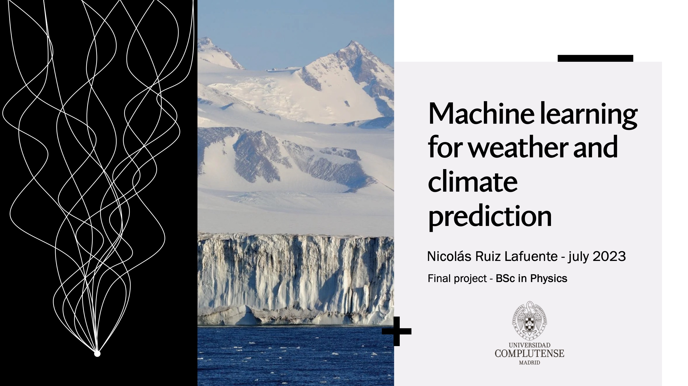

# deepL-wais
Deep Learning applied to the field of climate prediction, focused on the possible collapse of the West Antarctic Ice Sheet (WAIS).

## Motivation
This code is part of an end-of-degree-project for the BSc in Physics at Universidad Complutense de Madrid (UCM). The main objective of this work is to demonstrate the use of Machine Learning in the field of climate prediction, specifically, predicting the collapse of the West Antarctic Ice Sheet (WAIS).
